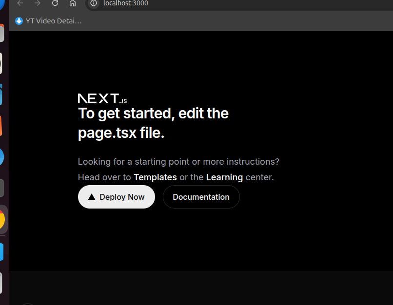

# DeFi Lending Protocol

A production-grade decentralised lending protocol built from scratch on Solidity, deployed on Ethereum Sepolia with a live Next.js frontend.

## Live Demo

**Frontend:** https://defi-frontend-o0vqeuyqi-sivajisjs-projects.vercel.app

**LendingPool on Etherscan:** https://sepolia.etherscan.io/address/0xc2a7809322bdce4d50e12ba05efdc967948b4870

---

## Screenshot



> Connected wallet showing 0.048 ETH balance, $13 USDC available liquidity, 5% borrow APR, 150% collateral ratio, live on Sepolia Testnet.

---

## What it does

- **Deposit WETH** as collateral — priced in real-time by Chainlink ETH/USD oracle
- **Borrow USDC** against collateral at a 150% collateral ratio
- **Health factor** calculated on-chain — positions below 1.0 are liquidatable
- **Liquidate** undercollateralised positions and earn a 10% bonus
- **UUPS upgradeable** — all 5 contracts can be upgraded without changing addresses

---

## Tech Stack

**Smart Contracts**
- Solidity 0.8.24
- Foundry (Forge, Anvil, Cast)
- OpenZeppelin Contracts + Upgradeable
- Chainlink Price Feeds
- UUPS Proxy Pattern

**Frontend**
- Next.js 14 (App Router)
- wagmi v2 + viem
- RainbowKit
- Tailwind CSS

---

## Architecture

```
User
 │
 └──► LendingPool.sol          ← Single entry point (UUPS upgradeable)
           │
           ├──► CollateralManager.sol   ← Tracks WETH/WBTC deposits
           │         └──► PriceOracle.sol   ← Chainlink ETH/USD, BTC/USD
           │
           ├──► BorrowEngine.sol        ← Tracks debt, accrues interest
           │
           └──► LiquidationEngine.sol  ← Closes risky positions with 10% bonus
```

---

## Protocol Parameters

| Parameter | Value |
|---|---|
| Collateral Ratio | 150% |
| Liquidation Threshold | 80% |
| Liquidation Bonus | 10% |
| Borrow APR | 5% |
| Price Feed Timeout | 3600 seconds |
| Min Health Factor | 1.0 |

---

## Deployed Contracts — Sepolia Testnet

| Contract | Proxy Address |
|---|---|
| LendingPool | [`0xc2a7809322bdce4d50e12ba05efdc967948b4870`](https://sepolia.etherscan.io/address/0xc2a7809322bdce4d50e12ba05efdc967948b4870) |
| CollateralManager | [`0x8435576e9034bad347ea7c85da1d47db2f2f85f5`](https://sepolia.etherscan.io/address/0x8435576e9034bad347ea7c85da1d47db2f2f85f5) |
| BorrowEngine | [`0xde34ef364de76e511e83d38ad1cdeb0c4ed2f4d9`](https://sepolia.etherscan.io/address/0xde34ef364de76e511e83d38ad1cdeb0c4ed2f4d9) |
| LiquidationEngine | [`0x3b1fad288e51a12ea62a841e9732ec468858ca0d`](https://sepolia.etherscan.io/address/0x3b1fad288e51a12ea62a841e9732ec468858ca0d) |
| PriceOracle | [`0x1e1abfb8152eb7509d9a5ecea2880c682443f4d6`](https://sepolia.etherscan.io/address/0x1e1abfb8152eb7509d9a5ecea2880c682443f4d6) |

All proxy addresses are permanent. Implementations can be upgraded via UUPS without changing the above addresses.

---

## Test Results

```
Running 12  tests — MocksTest              ✓
Running 23  tests — PriceOracleTest        ✓
Running 29  tests — CollateralManagerTest  ✓
Running 22  tests — BorrowEngineTest       ✓
Running 20  tests — LendingPoolTest        ✓
Running 18  tests — LiquidationEngineTest  ✓
Running 13  tests — UpgradeTest            ✓
Running 8   tests — InvariantTest          ✓

Suite result: ok. 145 passed; 0 failed
```

- **145+ unit and integration tests**
- **8 protocol invariants** — rules that must always hold no matter what sequence of actions users perform
- **25,000 random action sequences** generated by Foundry's fuzzer trying to break each invariant
- All passing

---

## Security Design

| Pattern | Applied where |
|---|---|
| CEI (Checks-Effects-Interactions) | Every function that transfers tokens |
| ReentrancyGuard | All state-mutating external functions |
| UUPS with onlyOwner | Upgrade authorisation gate |
| Chainlink staleness check | Reject prices older than 1 hour |
| Chainlink confidence check | Reject prices with too-wide spread |
| has_one / seeds constraints | Every PDA-equivalent ownership check |
| Arithmetic overflow protection | All financial math uses checked operations |

---

## Repository Structure

```
defi-lending-protocol/
│
├── contracts/              ← Solidity smart contracts (Foundry)
│   ├── src/                ← Contract source files
│   ├── test/               ← Unit, integration, invariant tests
│   └── script/             ← Deploy and interact scripts
│
├── frontend/               ← Next.js 14 frontend
│   ├── app/                ← Pages and layouts
│   ├── components/         ← UI components
│   ├── hooks/              ← wagmi data hooks
│   └── lib/                ← Addresses, ABIs, utilities
│
├── README.md               ← This file
├── DEVELOPER_GUIDE.md      ← Setup, testing, deployment guide
└── USER_GUIDE.md           ← How to use the protocol
```

---

## Getting Started

**To run the contracts locally:**
```bash
cd contracts
forge install
forge build
forge test -v
```

**To run the frontend locally:**
```bash
cd frontend
npm install
npm run dev
```

See [DEVELOPER_GUIDE.md](./DEVELOPER_GUIDE.md) for the full setup guide.

See [USER_GUIDE.md](./USER_GUIDE.md) for how to use the live protocol.

---

## Author

**Sivaji Gadidala** — Solana & EVM Blockchain Engineer

- GitHub: [@sivajisj](https://github.com/sivajisj)
- LinkedIn: [linkedin.com/in/sivaji](https://linkedin.com/in/sivaji)

---

*Deployed on Sepolia testnet. All tokens are test tokens with no real value.*
